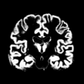

# Challenge for the recruitment of Data Science Internship

## Before starting

We encourage you to use specific tools to supply and isolate your code environment. The
recommended tool for this is Conda. It can be easily installed from the [miniconda
distribution](https://conda.io/projects/conda/en/latest/user-guide/install/index.html).

A list of basic packages is included in the `environment.yml` file. If your
favorite Deep Learning framework isn't inside, please install it yourself and don't forget
to add it to YAML file in your submission (otherwise we won't be able to launch your code).

## To start

1. Create a new environment with conda:

```
conda env create
```

2. Activate the environment

```
conda activate recruitment_excercise_vidmizer
```

## Exercise

The goal of this challenge is to propose a model using a Deep Learning method to classify brain images. You can chose the DL framework
of your preference.

**Important:** This is an oversimplified version of a typical DL classification
problem using MRI data with any scientific relevance. The main objective is to
have an idea of your technical skills and development practices.

The input images to train and validate your classifier are stored in the `data`  folder.
Images correspond to slices (121x121) of the coronal plane extracted from a preprocessed
anatomical MRI.
The original T1w MRIs were downloaded from the [OASIS
dataset](https://www.oasis-brains.org/) and were preprocessed.
Some images in the provided dataset are blurred.

The goal of the exercise is to train a classifier to separate blurred
images from sharp images. 

Example of a sharp image:



Example of a blurred image:


Inside each folder, there is a `subjects.tsv` file containing the identifier of
the subject (that corresponds to the image file name) and its label: (`1`) for sharp images
 and (`0`) for blurred images.

The expected output of the proposed algorithm should be a tsv file, the closest
possible to the `subjects.tsv` file inside the `validation` folder.

The folder `src/` contains a skeleton of the possible code that you might
produce. The file `test_run.py` is a basic test: it verifies if an output file is
created (inside the same folder) and, if it exits, it compares its content to
the content of the file inside `data/validation/subjects.tsv`. You can probably
test your code with a command like this:

```
python src/run.py && pytest
```
## Submission

To submit your solution,Create a brand new private repository on github or gitlab (private repo with Yassine and Mohamed as collaborators)


Don't hesitate to contact us if you have any question.

